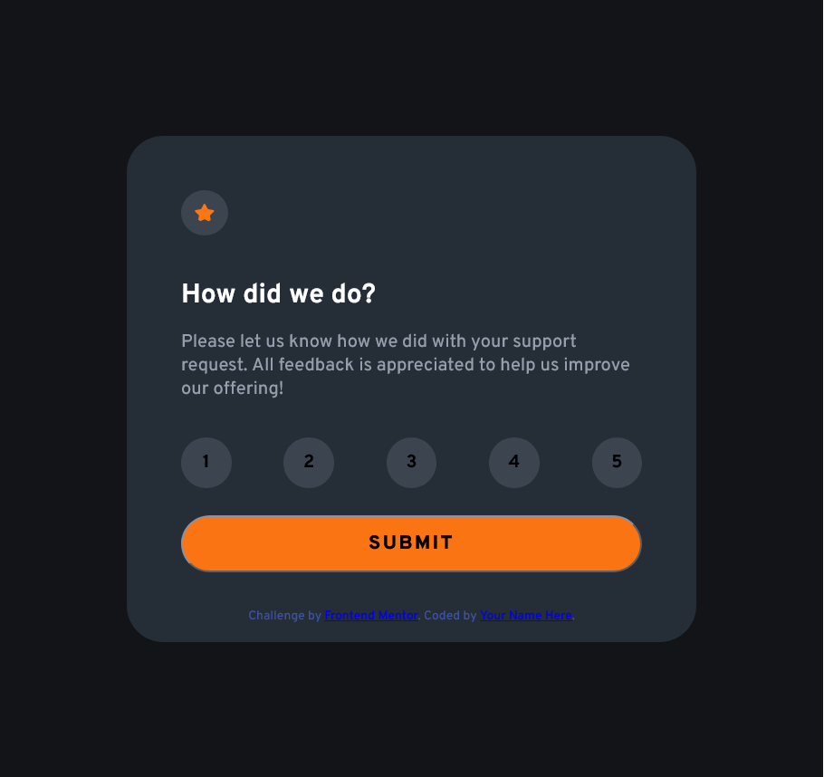

# Frontend Mentor - Interactive rating component solution

This is a solution to the [Interactive rating component challenge on Frontend Mentor](https://www.frontendmentor.io/challenges/interactive-rating-component-koxpeBUmI). Frontend Mentor challenges help you improve your coding skills by building realistic projects. 

## Table of contents📃

- [Overview](#overview)
  - [The challenge](#the-challenge)
  - [Screenshot](#screenshot)
  - [Links](#links)
- [My process](#my-process)
  - [Built with](#built-with)
- [Author](#author)
- [Acknowledgments](#acknowledgments)

## Overview

### The challenge🦾

Users should be able to:

- View the optimal layout for the app depending on their device's screen size
- See hover states for all interactive elements on the page
- Select and submit a number rating
- See the "Thank you" card state after submitting a rating

### Screenshot🖼️



### Links

- [My solution: 👀](https://www.frontendmentor.io/solutions/proyecto-hecho-con-html-js-css-puro-ok1ivXqpAd)
-  [Live Site URL:👀](https://arm4nd7.github.io/interactive-rating-component/)

## My process❓

### Built with🛠️

✔️ `HTML 5` para dar estructura a la página.<br>
✔️ `CSS` para dar estilo a la página y los componentes.<br>
✔️ `JS Vanilla` para dar dinamismo e interactividad a la página.<br>
✔️ `Diseño` uso de coleres y estilos proporcionados por [Frontend Mentor](https://www.frontendmentor.io).

## Estrucutra🏗️ 
```
Conference-Tickets/
├── src/
│   ├── assets/
│   │   ├── fonts
│   │   ├── images
│   ├── index.html          # Estructura de página
│   ├── styles.css          # Estilos y diseño
│   └── script.js           # Dinamismo y lógica.
├── package-lock.json
├── package.json
└── README.md               # Documentacion
```

## Author

- Website - [Armando Estevez](https://github.com/Arm4nd7)
- Frontend Mentor - [@Arm4nd7](https://www.frontendmentor.io/profile/Arm4nd7)

## Acknowledgments🎁
* Gracias a [👀 Frontend Mentor](https://www.frontendmentor.io/) realiza challenge y proporciona ayuda a desarrollo y diseño.